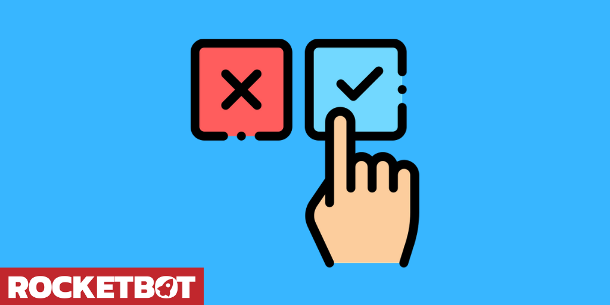

# Janela de diálogo
  
Muestra una ventana de dialogo y almacena la opción en una variable 

*Read this in other languages: [English](Manual_dialog_.md), [Portugues](Manual_dialog_.pr.md), [Español](Manual_dialog_.es.md).*
  

## Como instalar este módulo
  
__Baixe__ e __instale__ o conteúdo na pasta 'modules' no caminho do Rocketbot  

## Descrição do comando

### Janela de Confirmação
  
Mostra uma janela de confirmação e armazena o resultado
|Parâmetros|Descrição|exemplo|
| --- | --- | --- |
|Digite o título da janela|Título que terá a janela de confirmação|Prompt|
|Digite a mensagem da janela|Mensagem que terá a janela de confirmação|Digite o texto:|
|Atribuir resultado a uma variável||Variable|
